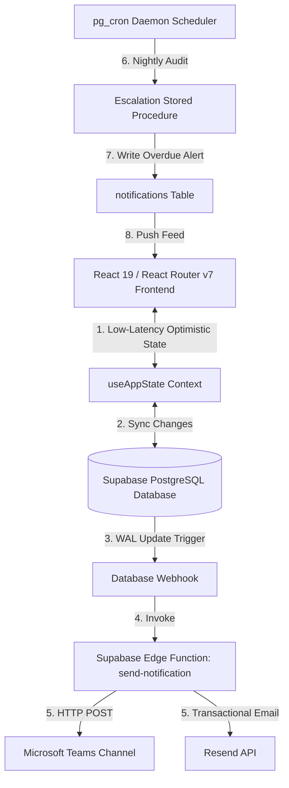

# AtomQuest — Enterprise OKR & Goal Alignment Platform 🎯

[](#)
[](#)
[](#)
[](#)

> Built for the **Atomberg Hackathon 2026**. A high-performance, real-time enterprise performance management system empowering employees, managers, and administrators to align goals, drive accountability, and automate performance reviews.

---

## 🌟 Hackathon Wow-Factor Superpowers

AtomQuest sets itself apart from standard applications by integrating high-end modern features built for visual excellence, performance, and automation:

### 1. ✨ AI OKR Coach (Groq Llama 3 Integration)
*   Integrated an intelligent prompt handler utilizing the **Groq Cloud API (`llama3-8b-8192`)**.
*   Secured using an **isolated server-side action (`/api/enhance-goal`)** so that enterprise credentials remain entirely protected from the frontend client.
*   Converts simple, informal descriptions into robust, highly quantifiable **SMART Goals** (Specific, Measurable, Achievable, Relevant, Time-Bound) with a single click.

### 2. 🎯 "Line of Sight" Goal Alignment Tree
*   An interactive, beautifully styled vertical lineage chart.
*   Draws structural paths connecting **Company OKRs** (set by HR/Admins) ➔ **Team OKRs** (set by Department Managers) ➔ **Individual Goals** (set by Employees), ensuring department-wide alignment visibility.

### 3. ⚡ Optimistic UI Synchronization Pattern
*   Designed a custom state synchronizer in `use-app-state.tsx`.
*   Fetches the entire organization's live datasets directly from Supabase upon initialization.
*   Performs instant mutations in-memory (providing near-zero latency for users) while concurrently updating cloud databases in the background.

### 🔔 Automated Real-Time Webhook Notifications
*   Leverages a **Supabase Database Trigger** listening to structural updates in the `goals` table.
*   Automatically invokes a **Supabase Edge Function (`send-notification`)** to deliver rich adaptive card payloads directly to Microsoft Teams channels and dispatch professional transactional emails using the **Resend API**.

### ⏰ Automated Escalation Engine (`pg_cron` Scheduled Tasks)
*   Integrates deep Postgres automated management using SQL.
*   Runs a cron scheduling service every night at midnight to check for overdue employee goal sheets and automatically issues escalation warnings directly into the database notifications.

---

## 🏗️ Architectural Topology



---

## 🛠️ Technology Stack

| Layer | Technology | Purpose |
| :--- | :--- | :--- |
| **Frontend Framework** | React 19 + React Router v7 | Seamless single-page transitions, file-system routing |
| **Type Safety** | TypeScript | Strong typing, autogenerated DB schemas |
| **Database & Auth** | Supabase (PostgreSQL) | Secure backend, low-latency API queries |
| **AI Processing** | Groq API (Llama 3 Model) | High-speed semantic SMART goal enhancement |
| **Styling** | Vanilla CSS Modules | Ultra-premium custom styling, custom animations |
| **Icons & Charts** | Tabler Icons, Recharts | Dynamic interactive data visualizations |

---

## 🔒 Security Architecture (RLS Policies)

AtomQuest enforces strict enterprise data confidentiality through native PostgreSQL **Row Level Security (RLS)**:

1. **`users` Table**: Authenticated users can view profiles in the same department; updates are restricted.
2. **`goals` Table**: Employees can only create/update their own goals. Managers can read their subordinate goals and apply approvals.
3. **`check_ins` Table**: Read/write access strictly bounded by direct reporting paths.
4. **`escalation_rules` & `audit_logs` Table**: Read-only for general staff; write permission limited strictly to administrators.

---

## 🚀 Installation & Local Development

### 1. Prerequisites
*   Node.js v18.0.0 or higher
*   Git version control

### 2. Clone the Repository & Install Dependencies
```bash
git clone https://github.com/rushikesh-bobade/goalflow.git
cd goalflow
npm install
```

### 3. Configure Local Environment Variables
Create a file named `.env` in the root folder and configure the following parameters:
```env
VITE_SUPABASE_URL=https://your-supabase-ref.supabase.co
VITE_SUPABASE_ANON_KEY=your-anon-api-key
GROQ_API_KEY=gsk_your-groq-api-key
```

### 4. Run Development Server
```bash
npm run dev
```
The server will boot locally on [http://localhost:5173/](http://localhost:5173/) (or the next available port).

### 5. Production Compilation Check
Verify build compilation and server-side rendering configurations:
```bash
npm run build
npm start
```

---

## 📂 Project Structure Reference

```
atombergshackathon/
├── app/
│   ├── blocks/                  # Segmented feature/component modules
│   │   ├── create-goal/         # Forms, validation, and AI enhancements
│   │   └── employee-dashboard/  # Weightage rings, alignment trees
│   ├── components/              # Global layout and authenticated page wrappers
│   ├── hooks/                   # Custom hooks (optimistic database state synchronizer)
│   ├── routes/                  # Route templates, dashboard interfaces, Groq API endpoints
│   └── styles/                  # Enterprise Design Token style specifications
├── public/                      # Static branding assets & premium SVG favicons
├── supabase/                    # Backend deployment configurations
│   ├── migrations/              # DDL schema definition scripts
│   ├── functions/               # Deno DRL-Edge triggers (Teams, Resend webhooks)
│   └── automations.sql          # pg_cron configurations and notification triggers
└── package.json                 # Project manifest
```

---

## 🏁 Git Branching & Versioning Standards

We adhere to the **Conventional Commits** specification for all code updates and require deployment-ready validations:

*   `feat(scope): ...` for new features (e.g. `feat(hackathon): implement AlignmentTree`)
*   `fix(scope): ...` for bugs and hotfixes (e.g. `fix(auth): solve navigation loops`)
*   `chore(scope): ...` for general tooling or housekeeping

All development features are validated locally via compilation checks before being integrated into the production branch.
